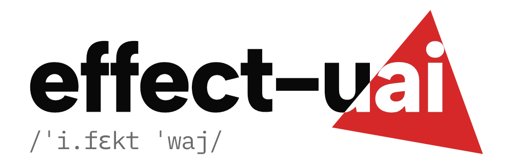

<p align="center">
  
</p>

[](https://www.npmjs.com/package/@effect-uai/core)
[](https://github.com/betalyra/effect-uai/actions/workflows/ci.yml)
[](./LICENSE)
[](https://www.npmjs.com/package/@effect-uai/core)
[](#status)
[](https://discord.gg/ebtwHGcyXR)

> **_Uai_** \\ wai \\. Mineiro Portuguese, all-purpose interjection.

**Low-level primitives for building AI agents with [Effect](https://effect.website).**

effect-uai is not a framework. There's no runtime to learn, no
orchestrator to override, no graph to fight. You get typed streaming
primitives (one turn, one tool call) and compose the loop yourself.

OpenAI Responses, Anthropic, Gemini, and any OpenAI-compatible gateway
normalize to one `TurnEvent` union. State is yours. The loop is yours.

## Status

While we're in `0.x`, minor releases may include breaking changes.
Each one ships with a [migration guide](https://effect-uai.betalyra.com/migrations/)
written in operator form ("if you see X, write Y"), so pointing Claude
Code at the page makes upgrades mechanical.

## Why effect-uai

Most agent libraries decide how your loop works: state shape, retry
policy, tool dispatch, cancellation. When you need something they
didn't plan for (approval gates, mid-stream cancel, fallback,
auto-compaction), you fight the framework.

effect-uai owns the wire (HTTP, SSE, event normalization, validation).
You own the policy. They meet at a `Stream<TurnEvent>` and a plain
state record.

## Features

- **Explicit control.** No black-box magic. You stay in full control of your agent loop.
- **Built on Effect.** Retries, streams, concurrency, errors: handled by Effect, not reinvented.
- **Composable primitives.** Small building blocks you assemble into your own agentic loops.
- **Recipes for the hard parts.** Copy-paste solutions for model council, auto-compaction, pause and resume, and more.
- **Streaming first.** Everything's a stream you can transform, filter, and collect when ready.
- **Typed errors.** Match `RateLimited`, `Unavailable`, or `Timeout` directly. No string parsing.
- **Carry your own state.** History, budget, scratchpad. Track whatever your agent needs. It's just a value.

## Quick taste

The canonical agent loop: stream a turn, run any tools the model
asks for, append the outputs, continue until it stops.

```ts
export const conversation = loop(initial, (state) =>
  Effect.gen(function* () {
    const oai = yield* Responses // swap for Anthropic / Gemini any turn
    return oai
      .streamTurn({ history: state.history, model, tools: toolkit }) // stream text, reasoning, tool events
      .pipe(
        onTurnComplete((turn) =>
          Effect.sync(() => {
            const calls = Turn.getToolCalls(turn) // approve, deny, audit, batch (it's your code)
            if (calls.length === 0) return stop() // stop on a final answer, a budget, your call
            return Toolkit.run(toolkit, calls).pipe(
              // run typed Effect tools
              Toolkit.continueWithResults(
                Toolkit.appendToolResults(state, turn), // fold results back into your state
              ),
            )
          }),
        ),
      )
  }),
)
```

For tools, approvals, multi-turn loops, sandboxes, and cross-provider
fallback, see the [docs](#docs--learn) or the
[recipes](#repo-layout).

## Packages

| Package                                                                 | What it is                                                                                                                                                                                                                                                                                 |
| ----------------------------------------------------------------------- | ------------------------------------------------------------------------------------------------------------------------------------------------------------------------------------------------------------------------------------------------------------------------------------------ |
| [`@effect-uai/core`](./packages/core)                                   | The primitives: `Loop`, `LanguageModel`, `Tool`, `Toolkit`, `Items`, `Turn`, `Transcriber`, `SpeechSynthesizer`, `EmbeddingModel`, `Reranker`, `Chunker`, `Tokenizer`, `MusicGenerator`, `ImageGenerator`, `WebSearch`, `WebRead`, `Browser`, `Sandbox`, `DeepResearch`. No provider deps. |
| [`@effect-uai/retrieval`](./packages/retrieval)                         | Retrieval-pipeline utilities: text chunking with provenance offsets, reciprocal rank fusion, and a Hugging Face tokenizer layer.                                                                                                                                                           |
| [`@effect-uai/responses`](./packages/providers/responses)               | OpenAI Responses provider. Implements `LanguageModel` over OpenAI's `/v1/responses` endpoint.                                                                                                                                                                                              |
| [`@effect-uai/chat-completions`](./packages/providers/chat-completions) | Reusable `/chat/completions` `LanguageModel` base. Point it at any compatible gateway: OpenRouter, Requesty, Groq, Together, self-hosted.                                                                                                                                                  |
| [`@effect-uai/anthropic`](./packages/providers/anthropic)               | Anthropic Messages provider, including extended thinking.                                                                                                                                                                                                                                  |
| [`@effect-uai/google`](./packages/providers/google)                     | Google Gemini: language model, embeddings, speech (sync STT + TTS), Nano Banana image generation, and Lyria music generation.                                                                                                                                                              |
| [`@effect-uai/mistral`](./packages/providers/mistral)                   | Mistral: `LanguageModel` (chat) plus Voxtral speech: realtime + batch STT and TTS. One brand for a full STT to LLM to TTS pipeline.                                                                                                                                                        |
| [`@effect-uai/openai`](./packages/providers/openai)                     | OpenAI brand package: Responses language models, embeddings, deep research, image generation (`gpt-image-2`, with partial-image streaming), and speech (`Transcriber` sync + realtime WS, `Synthesizer` sync + chunked HTTP).                                                              |
| [`@effect-uai/fal`](./packages/providers/fal)                           | fal image generation: FLUX, Seedream, Qwen Image, Muse and the open-weights field behind one key. The model id is an endpoint path.                                                                                                                                                        |
| [`@effect-uai/elevenlabs`](./packages/providers/elevenlabs)             | ElevenLabs: Scribe v2 Realtime STT, Flash v2.5 TTS with incremental-text-in WS, and music generation.                                                                                                                                                                                      |
| [`@effect-uai/inworld`](./packages/providers/inworld)                   | Inworld speech: first-party STT/TTS plus router-style passthroughs (AssemblyAI / Soniox / Groq Whisper).                                                                                                                                                                                   |
| [`@effect-uai/jina`](./packages/providers/jina)                         | Jina embeddings (dense, sparse ELSER, multivector ColBERT-style), reranking (text + image), and web read.                                                                                                                                                                                  |
| [`@effect-uai/perplexity`](./packages/providers/perplexity)             | Perplexity web search: fast, current-events snippets for grounding an LLM.                                                                                                                                                                                                                 |
| [`@effect-uai/exa`](./packages/providers/exa)                           | Exa: neural / semantic web search ranked by relevance score, plus web read.                                                                                                                                                                                                                |
| [`@effect-uai/tavily`](./packages/providers/tavily)                     | Tavily: web search with search-depth control, plus web read.                                                                                                                                                                                                                               |
| [`@effect-uai/firecrawl`](./packages/providers/firecrawl)               | Firecrawl web read: fetch a URL and get back clean, LLM-ready markdown.                                                                                                                                                                                                                    |
| [`@effect-uai/browser`](./packages/providers/browser)                   | Generic Chrome DevTools Protocol browser provider. Drive a real page as a tool.                                                                                                                                                                                                            |
| [`@effect-uai/mcp`](./packages/providers/mcp)                           | Model Context Protocol client. Any MCP server's tools become an ordinary `Toolkit`.                                                                                                                                                                                                        |
| [`@effect-uai/microsandbox`](./packages/providers/microsandbox)         | Local Firecracker microVM sandboxes via [microsandbox](https://github.com/microsandbox/microsandbox). Run untrusted code in isolation.                                                                                                                                                     |
| [`@effect-uai/deno`](./packages/providers/deno)                         | Hosted Firecracker microVM sandboxes on [Deno Deploy](https://docs.deno.com/deploy/). No local infra to run.                                                                                                                                                                               |
| [`@effect-uai/ai-sdk`](./packages/compat/ai-sdk)                        | Vercel AI SDK compatibility: render a `TurnEvent` stream as a `useChat` UI Message Stream.                                                                                                                                                                                                 |

Each provider is its own package - edge / browser builds only pull in
what you actually use.

## Repo layout

```
.
├── packages/
│   ├── core/                  # @effect-uai/core - primitives, no provider deps
│   ├── compat/
│   │   └── ai-sdk/            # @effect-uai/ai-sdk - Vercel AI SDK UI Message Stream
│   └── providers/
│       ├── responses/         # @effect-uai/responses - OpenAI Responses
│       ├── chat-completions/  # @effect-uai/chat-completions - gateway base
│       ├── anthropic/         # @effect-uai/anthropic
│       ├── google/            # @effect-uai/google - Gemini + speech + images + Lyria
│       ├── mistral/           # @effect-uai/mistral - LLM + Voxtral speech (STT/TTS)
│       ├── openai/            # @effect-uai/openai - Responses + embeddings + speech + images
│       ├── fal/               # @effect-uai/fal - image generation (FLUX, Seedream, Qwen)
│       ├── elevenlabs/        # @effect-uai/elevenlabs - speech + music
│       ├── inworld/           # @effect-uai/inworld - speech
│       ├── jina/              # @effect-uai/jina - embeddings + rerank + web read
│       ├── perplexity/        # @effect-uai/perplexity - web search
│       ├── exa/               # @effect-uai/exa - web search + web read
│       ├── tavily/            # @effect-uai/tavily - web search + web read
│       ├── firecrawl/         # @effect-uai/firecrawl - web read
│       ├── browser/           # @effect-uai/browser - CDP browser control
│       ├── mcp/               # @effect-uai/mcp - MCP client
│       ├── microsandbox/      # @effect-uai/microsandbox - local sandboxes
│       └── deno/              # @effect-uai/deno - hosted sandboxes
│   └── retrieval/             # @effect-uai/retrieval - chunking, rank fusion, tokenizer
├── recipes/                   # 39 worked recipes (type-checked, tested) covering
│                              # tools, approvals, fallback, voice, retrieval, MCP, …
├── recipes-extras/            # 3 recipes needing extra infra (agentic-search,
│                              # contextual-retrieval, sandbox-code-interpreter)
├── docs/                      # Source for the docs site (concepts, recipes, providers)
├── webpage/                   # Astro/Starlight site that renders docs/
├── skills/                    # Agent skills that teach a coding agent this library
├── examples/                  # Standalone apps; installed on their own, not workspace-globbed
└── integration-tests/         # Live-system smoke tests; run manually, not part of CI
```

A recipe folder typically contains:

- `recipe.ts` - the building blocks (tools, state, body), reusable in tests
- `app.ts` - provider wiring and rendering, runtime-agnostic
- `run-node.ts` / `run-bun.ts` / `run-deno.ts` - attach that runtime's `HttpClient`
- `recipe.test.ts` - vitest tests against `MockProvider`
- `README.md` - the page that's mirrored in the docs site

Older recipes still use a flatter `index.ts` / `index.test.ts` / `run.ts`
shape; both are current, and recipes migrate as they're touched.

## Docs / learn

Full docs: <https://effect-uai.betalyra.com>

Recommended reading order:

1. [One turn is a stream](https://effect-uai.betalyra.com/start/getting-started/) - the smallest provider-agnostic primitive.
2. [Basic usage](https://effect-uai.betalyra.com/recipes/basic-usage/) - the core agent harness: state, stream, tools, continuation.
3. [The loop primitive](https://effect-uai.betalyra.com/language-models/loop/) - what `loop` is, its shape, and `streamUntilComplete`.
4. [Items and turns](https://effect-uai.betalyra.com/language-models/items-and-turns/) - the conversation as a flat list, the assembled turn, the event stream.
5. [Tools and toolkits](https://effect-uai.betalyra.com/language-models/tools/) - `Tool.make` (with progress via `emit`), `Toolkit.make`, approval planners, `ToolEvent`.
6. [MCP](https://effect-uai.betalyra.com/language-models/mcp/) - point at an MCP server and its tools become a `Toolkit`.

Then dip into recipes for whatever pattern you need.

## Local development

```bash
pnpm install
pnpm test          # vitest run across all workspaces
pnpm typecheck     # tsc --noEmit
```

To run a recipe end-to-end against real providers:

```bash
OPENAI_API_KEY=sk-... pnpm tsx recipes/basic-usage/run-node.ts
```

### Nix dev shell (optional)

This repo ships a `flake.nix` that provides a dev shell with the exact
toolchain CI uses - Node 24, the pinned pnpm version (via corepack), and
Deno for the integration tests. It is **100% optional**: if you already
have Node and pnpm installed, ignore this entirely and use the commands
above.

If you do use [Nix](https://nixos.org/download) with flakes enabled:

```bash
nix develop          # drops you into a shell with node, pnpm and deno
```

The repo also ships an `.envrc`, so with [direnv](https://direnv.net/)
installed the shell loads automatically when you `cd` in - just run
`direnv allow` once. Without direnv the file is inert and ignored.

## Contributors

Thanks to everyone who has contributed to effect-uai.

<a href="https://github.com/betalyra/effect-uai/graphs/contributors">
  
</a>

## License

MIT - see [LICENSE](./LICENSE).
